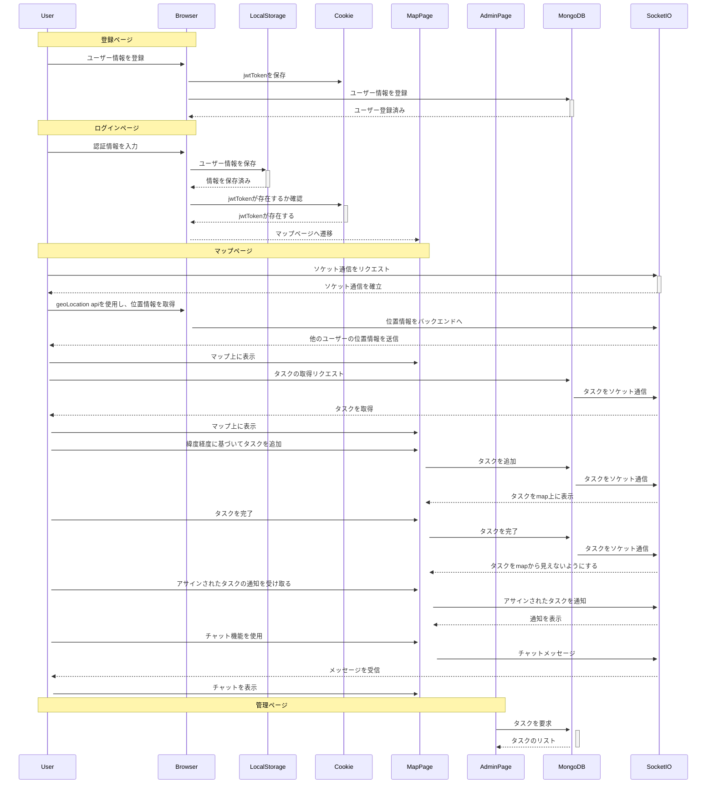

# [Task Mappin](https://taskmappin-c2989267e49d.herokuapp.com)

# Description
<p>
現場仕事がある社内向けのユーザー間の位置情報とタスクを共有することができるwebアプリケーション
</p>

# Usage
```bash
git clone https://github.com/takatokawazu/taskmappin.git
npm i
npm run start
cd client
npm i
npm run start
```

# 要件定義
## 目的
ユーザー間で位置情報とタスクを共有し、現場作業の効率を良くする。

## 開発経緯
父の経営する測量会社でアルバイトをした時、現場の仲間たちが位置情報とタスクの場所をうまく共有できていなかったので、作業が非常に非効率的だと感じました。その経験から、現場のメンバーがタスクの場所と位置情報を共有し、それをもとにタスクを効果的に割り振ることができれば、作業の効率が向上すると思いました。

## 工夫した点

## 機能要件
- ユーザー間で位置情報を共有
- ユーザー間のチャット機能
- タスクの場所を共有
- 管理画面から各ユーザーがタスクを確認することができる
  - 全てのタスク
  - ユーザーが完了したタスク
  - ユーザーが作ったタスク
  - 他のユーザーからアサインされたタスク
  - 未完了のタスク
  - 完了したタスク

## 非機能要件
- ビデオ通話機能
- slackなどのアプリと連携
  - タスクを完了した際の通知
  - 緊急メッセージの通知
  - OAuth
- excelなどのデータ形式からタスクをまとめて追加

# 設計

## 使用技術一覧

### フロントエンド
- 言語
  - javascript
- フレームワーク
  - React
  - Redux
- ライブラリ
  - socket.io-client

### バックエンド
- 言語
  - Node.js
- フレームワーク
  - express.js
- ライブラリ
  - socket.io
- データベース
  - MongoDB

### デプロイ環境
- heroku

## シーケンス図



## ER図


# 今後の目標

## 現状の課題

## 追加予定機能
