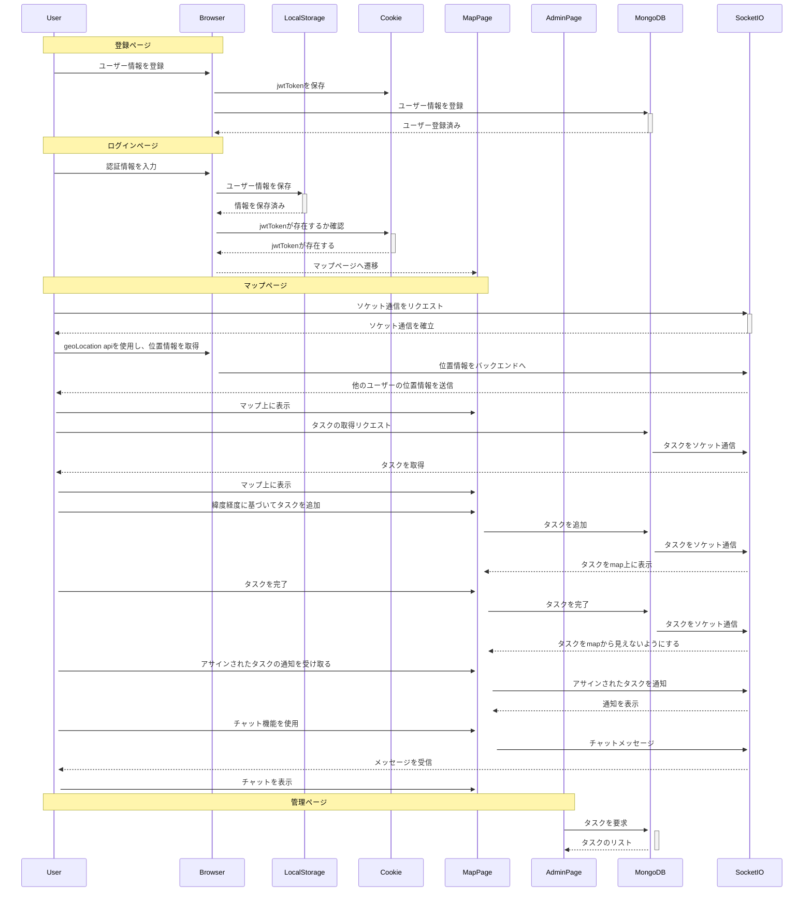

# [Task Mappin](https://taskmappin-c2989267e49d.herokuapp.com)

# 概要

現場仕事がある社内向けのユーザー間の位置情報とタスクを共有することができるwebアプリケーション

# 主要機能の使い方
## メッセージ送信
https://github.com/takatokawazu/taskmappin/assets/99064128/4642e348-8b63-4412-970a-d26002ac5a29

## タスク作成
https://github.com/takatokawazu/taskmappin/assets/99064128/c202694e-07e6-46d9-ad08-19f6422eebee

## タスク完了
https://github.com/takatokawazu/taskmappin/assets/99064128/20f54ac8-9151-4b3e-9b6e-e3f29d91c0c4

# 要件定義
## 目的

ユーザー間で位置情報とタスクを共有し、現場作業の効率を良くするwebアプリのプロトタイプ開発

プロトタイプでサービスの需要を確認

## 開発背景

  父の経営する測量会社でアルバイトをした時、現場の仲間たちが位置情報とタスクの場所をうまく共有できていなかったので、作業が非常に非効率的だと感じました。

その経験から、現場のメンバーがタスクの場所と位置情報を共有し、それをもとにタスクを効果的に割り振ることができれば、作業の効率が向上すると思いました。  

## 工夫した点

  位置情報を取得し、他のユーザーに共有する際にあえてデータベースとの通信をせず、socket通信のみを行いパフォーマンスを向上させた。

  ユーザーがチャットメッセージをあるユーザーに送信した際に、受信したユーザーがメッセージに気づきやすいようにするため、自動でチャットを表示させた。

## 機能要件
- ユーザー間で位置情報を共有
- ユーザー間のチャット機能
- タスクの場所を共有
- 管理画面から各ユーザーがタスクを確認することができる
  - 全てのタスク
  - ユーザーが完了したタスク
  - ユーザーが作ったタスク
  - 他のユーザーからアサインされたタスク
  - 未完了のタスク
  - 完了したタスク

## 非機能要件
- ビデオ通話機能
- slackなどのアプリと連携
  - タスクを完了した際の通知
  - 緊急メッセージの通知
  - OAuth
- excelなどのデータ形式からタスクをまとめて追加

# 設計

## 使用技術一覧

### フロントエンド
- 言語
  - javascript
- フレームワーク
  - React
  - Redux
- ライブラリ
  - socket.io-client

### バックエンド
- 言語
  - Node.js
- フレームワーク
  - express.js
- ライブラリ
  - socket.io
- データベース
  - MongoDB

### デプロイ環境
- heroku

## 使用技術の採用理由

このプロダクトで使用した技術の採用理由について説明します。

### フロントエンド: React/Redux
<b>検討技術:</b> Vue.js
 
<b>採用理由</b>
- 近年、フロントエンドのフレームワークで一番人気なのがreactのため
- Reactでのチーム開発の経験があるため
- React Nativeを使用することで、Reactを使用してモバイルアプリケーション（iOSおよびAndroid）を開発することができるため
- プロジェクトの規模が大きくなった場合でも、容易に状態を管理することができるようにするためReduxを採用

[参照](https://gist.github.com/tkrotoff/b1caa4c3a185629299ec234d2314e190)

### バックエンド: Node.js
<b>検討技術:</b> php
 
<b>採用理由</b>
- フロントエンドとバックエンドの両方でjavascriptを使って開発することができる
- Node.jsでの開発経験があるため

### データベース: MongoDB
<b>検討技術:</b> MySQL, firebase functions
 
<b>採用理由</b>
- 開発方針として、アジャイル開発をしていたため、データベースの拡張性と開発スピードを重視した
- NoSQLデータベースの方がSQLデータベースよりも使い慣れているため
- リファレンス、populateを利用することで、リレーションを持たせ、データを結合することが可能になる
- NoSQLデータベースの中で最も人気なサービス

[参照](https://6sense.com/tech/nosql-databases)

### リアルタイム通信: WebSocket (socket.io)
<b>検討技術:</b> Pusher, Firebase Realtime Database
 
<b>採用理由</b>
- トラフィック量に応じた料金が発生しないこと
- カスタマイズ性が他の2つに比べると高い
- 学習教材が多い

### デプロイ環境: heroku
<b>検討技術:</b> vercel/aws
 
<b>採用理由</b>
- 素早くアプリケーションをデプロイすることができる
- 運用作業が必要ないため、プロトタイプに最適

## シーケンス図

## ER図

# 今後の目標

## 現状の課題

### 1. ユーザーにとって、利用しにくい部分がある
- プッシュ通知機能が不足しているため、モバイルアプリのような通知を受けられず、サイト訪問回数が減少してしまっている
- ユーザーの実際のフィードバックから、モバイルアプリの方が使いやすいことが明らかになった

### 2. タスクがアサインされたことにユーザーが気づきにくい問題がある
- プッシュ通知機能が不足しているため、ユーザーはサイトを開かない限り、アサインされたタスクに気づくことができない

### 3. タスクを一括で追加できない制約がある
- 現在の実装では、ユーザーは地図から検索してタスクを一つずつ追加する必要があり、これが手間だというフィードバックを受けた

### 4. 現場社員以外のスタッフがタスクの詳細を確認できない
- アプリにログインし、オンラインの状態でない限り、タスクの詳細を確認することができない

## 追加予定機能

### １. 現在のサービスを改善し、機能追加していく
#### ユーザー向け
- 通話機能
  - WebRTCを利用したビデオ通話機能の実現を検討中
  - または、ユーザー登録時に電話番号の入力を必須にして、電話をかけられるようにするオプションを検討中
- タスクを一括追加機能
  - タスクの管理画面ページからexcelなどのデータを一括でデータベースに追加
- オフラインユーザーの位置情報を表示
  - ユーザーがオンラインで最後にアクティブだった時間と場所を表示する機能

#### 非ユーザー(エンジニア)向け
- javascriptからTypescriptへの変換
  - コードの安全性向上
  - 多くの企業がTypeScriptを採用しており、将来の拡張性を考慮

- webアプリからモバイルアプリへの移行
  - React Nativeを使用し、クロスプラットフォーム対応
 
- 他サービスとの連携
  - OAuthを利用し、ユーザー認証
  - Webhookを使用して、アクションの詳細情報を取得し、現場社員以外のスタッフにタスクの状態変更などの通知を送る機能
 
- インフラの変更
  - HerokuからAWSなど柔軟なカスタマイズが可能なプラットフォームへの移行を検討中

- オフラインユーザーの位置情報を表示
  - ユーザーがページを離れたときに、その時の位置情報をデータベースに保存し、オンラインでの最終アクティビティからの経過時間と位置情報を表示する機能
  
### 2. 社内向けサービスから他社企業向けのサービスへと展開
#### ユーザー向け
- adminユーザーがユーザーの参加を承認することができる

- 各企業でそれぞれの設定ができるようにする
  - デフォルトの位置情報 (今回の場合は、熊本)
  - ユーザーの権限
